# Streaming Data Stack Hands-On

**Learning Project: Building Real-Time ETL with Kafka, Flink, Polars, Iceberg, and Claude**

A hands-on learning project exploring modern streaming data architecture. Uses schema evolution as the learning vehicle—schema changes trigger Claude to generate Flink SQL & Polars code, which are validated by GitHub Actions. First hands-on project diving into streaming systems from scratch.

**Repository:** [`streaming-etl-handson`](https://github.com/Karasu1t/streaming-etl-handson)

---

## 日本語: プロジェクト概要

**背景:** 11年のプラットフォームエンジニアリング経験を持つが、ストリーミングデータ領域は初心者。Kafka / Flink / Polars / Iceberg / Rust といった現代的なストリーミングスタックがどう組み合わさるのか、実践を通じて学びたい。

**学習題材:** 広告プラットフォームのスキーマ変更を例として、以下を体系的に習得：

- **Flink SQL**: ストリームの状態管理と変換
- **Polars (Rust)**: 型安全性を備えた高速列計算
- **Iceberg**: スキーマ進化をサポートするテーブルフォーマット
- **Claude API**: コード生成の自動化（draftから validationまで）
- **GitHub Actions**: ストリーミングパイプラインのCI/CD

**成果物:** スキーマ変更→Claude生成→構文check→単体テスト→Icebergスキーマ検証→PR報告、という一連のワークフローの実装と理解。

---

## What This Does

1. **Detect & Input**: Platform schema change notification (e.g., "Column X added")
2. **Acquire Spec**: Download CSV with updated column definitions
3. **Interactive Fix**: Claude API dialogue to generate Flink SQL & Polars transform updates
4. **Commit & PR**: Push changes, create PR
5. **Validate & Report**: GitHub Actions runs syntax check + pytest + Iceberg schema validation, surfaces results in PR comment

**Key Outcome:** Schema change → Claude generates code → validate with syntax check + pytest + Iceberg checks → proof in PR, all within one workflow.

---

## Technical Stack

| Component          | Purpose                     | Why                                                               |
| ------------------ | --------------------------- | ----------------------------------------------------------------- |
| **Flink SQL**      | Streaming transformation    | Real-time event processing; stateful operators; Iceberg connector |
| **Polars (Rust)**  | High-performance transforms | Columnar compute; type-safe; perfect for schema-driven pipelines  |
| **Iceberg**        | Streaming table format      | Schema evolution support; portable; built for Flink integration   |
| **Claude API**     | Interactive job adaptation  | Understands SQL & data lineage; generates schema-aware transforms |
| **GitHub Actions** | CI/CD pipeline              | Proof & auditability; validates Flink SQL + Polars code           |
| **Python + Rust**  | CLI tool (`ut-etl` command) | Orchestrates CSV spec, Claude dialogue, validation jobs           |

---

## Why These Choices

| Concern              | Solution                                                      | Trade-off                                   |
| -------------------- | ------------------------------------------------------------- | ------------------------------------------- |
| **Quality variance** | AI-assisted + syntax validation + pytest → rules enforcement  | Requires comprehensive test suite           |
| **Reproducibility**  | Code-as-spec (CSV) + Flink/Polars + Git history               | Streaming complexity; local testing setup   |
| **Governance**       | PR + CI gates before merge; Claude output is draft, not final | Not fully autonomous; human review required |
| **Type Safety**      | Polars (Rust) + schema validation + Iceberg checks            | Adds Rust dependency; learning curve        |

---

## Workflow Diagram

```mermaid
graph LR
    Notify["📢 Platform Change<br/>Notified"] -->|"Column X updated"| Acquire["📥 Download CSV<br/>Column Spec"]
    Acquire --> Dialog["💬 Claude Dialogue<br/>Flink + Polars Fix"]
    Dialog -->|"Flink SQL<br/>& Polars code"| Commit["📝 Commit & Push"]
    Commit --> PR["🔀 Create PR"]
    PR -->|"Trigger"| GHA["⚙️ GitHub Actions"]
    GHA -->|"1. Syntax"| Syntax["Flink SQL parse<br/>Rust check"]
    Syntax -->|"2. Unit Test"| Test["pytest on Polars<br/>transformations"]
    Test -->|"3. Schema"| Schema["Iceberg schema<br/>validation"]
    Schema -->|"✅/❌"| Comment["💬 PR Comment<br/>with Results"]
    Comment --> Gate{Merge?}
    Gate -->|"✅ All Green"| Merge["✓ Ready"]
    Gate -->|"❌ Failed"| FixNeeded["Fix & Re-push"]
```



---

## Scope

### In Scope ✅

- **Spec Handling**: CSV download and parsing
- **Claude Integration**: Interactive Flink SQL & Polars transform generation
- **Flink Jobs**: Streaming SQL scaffolds, schema-aware transformations
- **Polars Transforms**: Python/Rust implementations with type hints
- **GitHub Actions**: PR-triggered validation (syntax → pytest → Iceberg checks)
- **PR Reporting**: Surfaces test results, schema validation errors
- **Local Dev**: Reproducible setup with sample CSV & Iceberg table schema

### Out of Scope ❌

- Automatic schema change detection (assumed notified)
- Google Drive API integration (CSV download is manual or via URL)
- Kafka cluster provisioning or management
- Full data lineage tracing or impact analysis
- Production deployment automation
- Real Kafka/Flink cluster setup (Phase 1 uses local mock)

**Assumption:** This is a **personal portfolio** demonstrating **AI-assisted streaming ETL workflows**. Phase 1 focuses on code generation, validation, and local testing. Phase 2 adds Kafka integration.

---

## Learning Goals

**Primary Objective**: Hands-on mastery of modern streaming data architecture

- **Understand Flink**: Stateful stream processing, event-time semantics, connectors
- **Master Polars**: Type-safe columnar transforms, integration with Rust ecosystem
- **Learn Iceberg**: Schema evolution, portable table format, Flink integration
- **Practice Claude API**: Using AI to generate streaming code candidates
- **Implement CI/CD**: Validating generated code through syntax checks, unit tests, schema checks

**Real-World Context**: Schema changes are common in ad-tech; automating response to those changes (via code generation) is a practical learning vehicle that touches all parts of the stack.

---

## Technology Rationale

### Flink SQL

- **Why**: Real-time stream processing; native Iceberg connector; stateful transformations
- **Expertise**: First hands-on project with Flink; distributed streaming foundation

### Polars (Rust)

- **Why**: Type-safe, columnar, high-performance; excellent for schema-driven ETL
- **Benefit**: Rust's compile-time safety + Python's ease; natural fit for CSV→table transformations

### Iceberg

- **Why**: Built for schema evolution; portable table format; native Flink support
- **Advantage**: Handles breaking schema changes gracefully; open format (not vendor-locked)

### Claude API

- **Why**: Context-aware; understands SQL and data pipelines; generates schema-compatible code
- **Not**: Fully autonomous; all outputs are validated by syntax check + tests before merge

### GitHub Actions

- **Why**: Native Git integration; proof-of-execution visible in PR; no external service needed
- **Outcome**: Each schema change has complete audit trail (commit, PR, checks, test logs)

---

## Roadmap

### Phase 1: Foundation (Planned — 12 days)

- [ ] Flink SQL job scaffold (source → transform → sink)
- [ ] Polars transform library with schema validation
- [ ] Python CLI tool (`ut-etl` command)
- [ ] Claude API integration (Flink SQL & Polars code generation)
- [ ] GitHub Actions workflow (syntax check + pytest + Iceberg validation)
- [ ] Sample CSV spec file (old & updated schemas)
- [ ] Iceberg table setup & schema registry
- [ ] End-to-end demo + screenshots

### Phase 2: Streaming Integration (Future)

- [ ] Kafka broker setup & topic management
- [ ] Flink Kafka connector (source)
- [ ] Google Drive API integration (auto-download CSV specs)
- [ ] Advanced Polars transforms (aggregations, joins)
- [ ] Integration test suite (Docker + embedded Kafka)

### Phase 3: Production Readiness (Future)

- [ ] Kubernetes deployment (Flink on K8s)
- [ ] Multi-environment support (dev/staging/prod)
- [ ] Metrics & observability (Prometheus + Grafana)
- [ ] RBAC & secrets management

---

## Key Files (Future)

```
.
├── README.md                    (this file)
├── LICENSE                      (MIT)
├── .gitignore
├── .github/
│   └── workflows/
│       ├── pr-validate.yml      (syntax check + pytest + Iceberg on PR)
│       └── schema-registry.yml  (optional: track Iceberg schema versions)
├── flink_jobs/
│   ├── src/
│   │   ├── main/
│   │   │   ├── java/
│   │   │   │   └── com/etl/
│   │   │   │       ├── SourceJob.java
│   │   │   │       ├── TransformJob.java
│   │   │   │       └── IcebergSinkJob.java
│   │   │   └── resources/
│   │   │       └── flink-config.yaml
│   │   └── test/
│   │       └── java/
├── polars_transforms/
│   ├── Cargo.toml               (Rust config)
│   ├── src/
│   │   ├── lib.rs               (main transforms)
│   │   ├── schema.rs            (schema validation)
│   │   └── transforms.rs        (columnar ops)
│   └── tests/
│       └── transform_tests.py   (pytest for Polars)
├── src/
│   ├── ut_etl/
│   │   ├── cli.py               (entry point: ut-etl command)
│   │   ├── claude_agent.py      (Claude API caller)
│   │   ├── csv_loader.py        (CSV parsing)
│   │   ├── flink_generator.py   (Flink SQL generation)
│   │   └── polars_generator.py  (Polars transform generation)
│   └── tests/
│       ├── test_claude_agent.py
│       ├── test_csv_loader.py
│       └── test_generators.py
├── specs/
│   ├── sample_columns.csv       (mock: old ad platform schema)
│   └── sample_columns_updated.csv (mock: new schema with added columns)
├── iceberg/
│   ├── schema.yaml              (Iceberg table metadata)
│   └── fixtures/                (sample data for testing)
└── docs/
    ├── 01_setup.md
    ├── 02_flink_sql_guide.md
    ├── 03_polars_transforms.md
    └── 04_claude_prompts.md
```

---

## Getting Started (Placeholder)

```bash
# Clone repo
git clone https://github.com/Karasu1t/etl-schema-evolution-claude.git
cd etl-schema-evolution-claude

# Create Python venv
python3 -m venv venv
source venv/bin/activate

# Install Python dependencies
pip install -r requirements.txt

# Build Rust Polars transforms (optional, or use pre-built)
cd polars_transforms && cargo build --release && cd ..

# Set Claude API key
export CLAUDE_API_KEY="your-key-here"

# Run demo (future)
python src/ut_etl/cli.py \
  --csv specs/sample_columns_updated.csv \
  --flink-jobs flink_jobs/ \
  --polars-transforms polars_transforms/
```

See [docs/01_setup.md](docs/01_setup.md) for detailed instructions.

---

## Design Philosophy

1. **Learn by Building**: Not studying documentation alone—build a complete end-to-end system
2. **Real Constraints**: Schema changes are real; code generation must be validated by real tests
3. **Type Safety**: Use Rust's type system as a teaching tool; catch schema mismatches at compile time
4. **Auditability**: Every change is a Git commit, PR, and CI log—proof of learning progression
5. **AI as Accelerator**: Claude helps generate scaffolding; testing ensures correctness
6. **Deliberate Complexity**: Flink + Polars + Iceberg are genuinely complex—the difficulty is the point

---

## About

**What This Is**: A **deliberate hands-on learning project** to master streaming data architecture from scratch.

**Background**: 11 years in platform engineering (ad-tech, data infrastructure); now upskilling in modern streaming systems.

**Why This Stack**:

- **Kafka**: De facto standard for event streaming
- **Flink**: Best-in-class stateful stream processor with Iceberg support
- **Polars**: Modern columnar compute with Rust safety guarantees
- **Iceberg**: Streaming + batch; handles schema evolution gracefully
- **Claude API**: Exploring AI-assisted code generation patterns

**Learning Outcomes** (documented via code, tests, and CI logs):

- End-to-end streaming pipeline architecture
- Stateful transformations and event-time semantics
- Type-safe ETL with Rust + Polars
- Schema evolution patterns with Iceberg
- CI/CD validation for data workloads

**Target**: Switzerland/EU data engineering roles (2028). This project demonstrates deep learning in a modern technology stack.

---

## License

MIT License. See [LICENSE](LICENSE) for details.

---

## Questions or Feedback?

This repository is a **living portfolio**. If you spot ideas for improvement, feel free to discuss or fork.

**Built with:** Claude + Flink + Polars + Iceberg + GitHub Actions
**Last Updated:** May 2026
