# Claude-Powered CSV Schema-to-Code Generation

**Automating Streaming ETL Adaptation to Schema Changes**

Addresses a real ad-tech operational challenge: frequent CSV schema changes require manual code generation, test creation, and reviews—leading to toil, quality variance, and bottlenecks. This project uses Claude AI to automatically generate Flink SQL, Polars transforms, and test code from CSV schema changes, validated through GitHub Actions. Result: reproducible, quality-uniform schema adaptations without manual rework.

**Repository:** [`streaming-etl-handson`](https://github.com/Karasu1t/streaming-etl-handson)

---

## 日本語: プロジェクト概要

**背景・課題:**

広告プラットフォームが提供する CSV のカラム構成は、頻繁に変更される（月 1-2 回程度）。
従来の対応プロセス：

1. カラム定義の修正（手動）
2. テスト仕様書の作成（手動）
3. コードレビュー・テスト実施
4. 本番デプロイ

**問題点：**

- 修正作業が属人化している
- 作業者や日時により、テスト内容や品質にばらつきが出る
- 在席していないメンバーへの対応が難しい
- 各回のスキーマ変更で同じ作業を繰り返す（DRY 原則違反）

**ソリューション:**

Claude AI を呼び出し、CSV のカラム定義（old + new）をもとに以下を自動生成：

- **Flink SQL**: ストリーム変換ロジック
- **Polars code**: 型安全な schema validation
- **Unit tests**: テスト仕様の自動作成
- **Iceberg DDL**: テーブルスキーマ定義

生成されたコードは GitHub Actions で自動検証（構文check + pytest + schema validation）を経て PR に上げられる。

**技術スタック：**

- **Claude API**: 「CSV schema → 構造化コード」の核
- **Flink + Iceberg**: 既存の streaming ETL パイプライン（CSV ingestion → transformation）
- **Polars (Rust)**: Transform の型安全性
- **GitHub Actions**: 生成コードの自動検証

---

## What This Does

1. **Detect & Input**: Platform schema change notification (e.g., "Column X added")
2. **Acquire Spec**: Download CSV with updated column definitions
3. **Interactive Fix**: Claude API dialogue to generate Flink SQL & Polars transform updates
4. **Commit & PR**: Push changes, create PR
5. **Validate & Report**: GitHub Actions runs syntax check + pytest + Iceberg schema validation, surfaces results in PR comment

**Key Outcome:** Schema change → Claude generates code → validate with syntax check + pytest + Iceberg checks → proof in PR, all within one workflow.

---

## Technical Stack

| Component          | Purpose                     | Why                                                               |
| ------------------ | --------------------------- | ----------------------------------------------------------------- |
| **Flink SQL**      | Streaming transformation    | Real-time event processing; stateful operators; Iceberg connector |
| **Polars (Rust)**  | High-performance transforms | Columnar compute; type-safe; perfect for schema-driven pipelines  |
| **Iceberg**        | Streaming table format      | Schema evolution support; portable; built for Flink integration   |
| **Claude API**     | Interactive job adaptation  | Understands SQL & data lineage; generates schema-aware transforms |
| **GitHub Actions** | CI/CD pipeline              | Proof & auditability; validates Flink SQL + Polars code           |
| **Python + Rust**  | CLI tool (`ut-etl` command) | Orchestrates CSV spec, Claude dialogue, validation jobs           |

---

## Why These Choices

| Concern              | Solution                                                      | Trade-off                                   |
| -------------------- | ------------------------------------------------------------- | ------------------------------------------- |
| **Quality variance** | AI-assisted + syntax validation + pytest → rules enforcement  | Requires comprehensive test suite           |
| **Reproducibility**  | Code-as-spec (CSV) + Flink/Polars + Git history               | Streaming complexity; local testing setup   |
| **Governance**       | PR + CI gates before merge; Claude output is draft, not final | Not fully autonomous; human review required |
| **Type Safety**      | Polars (Rust) + schema validation + Iceberg checks            | Adds Rust dependency; learning curve        |

---

## Workflow Diagram

```mermaid
graph LR
    Notify["📢 Platform Change<br/>Notified"] -->|"Column X updated"| Acquire["📥 Download CSV<br/>Column Spec"]
    Acquire --> Dialog["💬 Claude Dialogue<br/>Flink + Polars Fix"]
    Dialog -->|"Flink SQL<br/>& Polars code"| Commit["📝 Commit & Push"]
    Commit --> PR["🔀 Create PR"]
    PR -->|"Trigger"| GHA["⚙️ GitHub Actions"]
    GHA -->|"1. Syntax"| Syntax["Flink SQL parse<br/>Rust check"]
    Syntax -->|"2. Unit Test"| Test["pytest on Polars<br/>transformations"]
    Test -->|"3. Schema"| Schema["Iceberg schema<br/>validation"]
    Schema -->|"✅/❌"| Comment["💬 PR Comment<br/>with Results"]
    Comment --> Gate{Merge?}
    Gate -->|"✅ All Green"| Merge["✓ Ready"]
    Gate -->|"❌ Failed"| FixNeeded["Fix & Re-push"]
```



---

## Scope

### In Scope ✅

- **Spec Handling**: CSV download and parsing
- **Claude Integration**: Interactive Flink SQL & Polars transform generation
- **Flink Jobs**: Streaming SQL scaffolds, schema-aware transformations
- **Polars Transforms**: Python/Rust implementations with type hints
- **GitHub Actions**: PR-triggered validation (syntax → pytest → Iceberg checks)
- **PR Reporting**: Surfaces test results, schema validation errors
- **Local Dev**: Reproducible setup with sample CSV & Iceberg table schema

### Out of Scope ❌

- Automatic schema change detection (assumed notified)
- Google Drive API integration (CSV download is manual or via URL)
- Kafka cluster provisioning or management
- Full data lineage tracing or impact analysis
- Production deployment automation
- Real Kafka/Flink cluster setup (Phase 1 uses local mock)

**Assumption:** This is a **personal portfolio** demonstrating **AI-assisted streaming ETL workflows**. Phase 1 focuses on code generation, validation, and local testing. Phase 2 adds Kafka integration.

---

## Expected Outcomes

**Primary Objective**: Automate CSV schema change adaptation with consistent quality

- **Quality Uniformity**: Eliminate human variance; consistent test coverage via automated test generation
- **Reproducibility**: Every schema change follows the same workflow; no silos
- **Reduced Toil**: Human reviewers focus on logic correctness, not mechanical code generation
- **Knowledge Decentralization**: Any team member can handle schema changes using this workflow

---

## Why Claude Powers This

### Claude API (Core Innovation)

- **What it does**: Understands CSV schema changes; generates valid Flink SQL + Polars code + test cases
- **Role**: Converts manual code generation task into reproducible dialogue
- **Validation**: All Claude outputs are syntax-checked + pytest'd + schema-validated before merge (never autonomous)
- **Quality**: Eliminates variance in generated code and test coverage across all schema changes

### Supporting Infrastructure

- **Flink SQL + Iceberg**: Existing streaming ETL pipeline (handles CSV ingestion and real-time transformation)
- **Polars (Rust)**: Type-safe transforms; Rust's compile-time checks catch schema mismatches
- **GitHub Actions**: Automated validation gate; syntax check + pytest + Iceberg schema check

---

## Roadmap

### Phase 1: Foundation (Planned)

- [ ] Flink SQL job scaffold (source → transform → sink)
- [ ] Polars transform library with schema validation
- [ ] Python CLI tool (`ut-etl` command)
- [ ] Claude API integration (Flink SQL & Polars code generation)
- [ ] GitHub Actions workflow (syntax check + pytest + Iceberg validation)
- [ ] Sample CSV spec file (old & updated schemas)
- [ ] Iceberg table setup & schema registry
- [ ] End-to-end demo + screenshots

### Phase 2: Streaming Integration (Future)

- [ ] Kafka broker setup & topic management
- [ ] Flink Kafka connector (source)
- [ ] Google Drive API integration (auto-download CSV specs)
- [ ] Advanced Polars transforms (aggregations, joins)
- [ ] Integration test suite (Docker + embedded Kafka)

### Phase 3: Production Readiness (Future)

- [ ] Kubernetes deployment (Flink on K8s)
- [ ] Multi-environment support (dev/staging/prod)
- [ ] Metrics & observability (Prometheus + Grafana)
- [ ] RBAC & secrets management

---

## Key Files (Future)

```
.
├── README.md                    (this file)
├── LICENSE                      (MIT)
├── .gitignore
├── .github/
│   └── workflows/
│       ├── pr-validate.yml      (syntax check + pytest + Iceberg on PR)
│       └── schema-registry.yml  (optional: track Iceberg schema versions)
├── flink_jobs/
│   ├── src/
│   │   ├── main/
│   │   │   ├── java/
│   │   │   │   └── com/etl/
│   │   │   │       ├── SourceJob.java
│   │   │   │       ├── TransformJob.java
│   │   │   │       └── IcebergSinkJob.java
│   │   │   └── resources/
│   │   │       └── flink-config.yaml
│   │   └── test/
│   │       └── java/
├── polars_transforms/
│   ├── Cargo.toml               (Rust config)
│   ├── src/
│   │   ├── lib.rs               (main transforms)
│   │   ├── schema.rs            (schema validation)
│   │   └── transforms.rs        (columnar ops)
│   └── tests/
│       └── transform_tests.py   (pytest for Polars)
├── src/
│   ├── ut_etl/
│   │   ├── cli.py               (entry point: ut-etl command)
│   │   ├── claude_agent.py      (Claude API caller)
│   │   ├── csv_loader.py        (CSV parsing)
│   │   ├── flink_generator.py   (Flink SQL generation)
│   │   └── polars_generator.py  (Polars transform generation)
│   └── tests/
│       ├── test_claude_agent.py
│       ├── test_csv_loader.py
│       └── test_generators.py
├── specs/
│   ├── sample_columns.csv       (mock: old ad platform schema)
│   └── sample_columns_updated.csv (mock: new schema with added columns)
├── iceberg/
│   ├── schema.yaml              (Iceberg table metadata)
│   └── fixtures/                (sample data for testing)
└── docs/
    ├── 01_setup.md
    ├── 02_flink_sql_guide.md
    ├── 03_polars_transforms.md
    └── 04_claude_prompts.md
```

---

## Getting Started (Placeholder)

```bash
# Clone repo
git clone https://github.com/Karasu1t/etl-schema-evolution-claude.git
cd etl-schema-evolution-claude

# Create Python venv
python3 -m venv venv
source venv/bin/activate

# Install Python dependencies
pip install -r requirements.txt

# Build Rust Polars transforms (optional, or use pre-built)
cd polars_transforms && cargo build --release && cd ..

# Set Claude API key
export CLAUDE_API_KEY="your-key-here"

# Run demo (future)
python src/ut_etl/cli.py \
  --csv specs/sample_columns_updated.csv \
  --flink-jobs flink_jobs/ \
  --polars-transforms polars_transforms/
```

See [docs/01_setup.md](docs/01_setup.md) for detailed instructions.

---

## Design Philosophy

1. **Automation, Not Manual Toil**: CSV spec → Claude → validated code, no copy-paste
2. **Validation Before Trust**: Syntax check + pytest + schema checks; Claude is draft generator only
3. **Decentralized Knowledge**: Any team member can execute the workflow; reduces silos
4. **Audit Trail for Compliance**: Every change is Git commit + PR + CI logs; traceable
5. **Type Safety as Quality Gate**: Polars (Rust) + Iceberg schema validation catch errors early
6. **Deliberate Tech Choices**: Each technology solves a specific operational problem

---

## About

**What This Is**: A practical solution to a recurring operational challenge in ad-tech.

**The Core Problem**: CSV schema changes require manual code generation, test creation, and reviews—creating toil and quality variance.

**The Core Solution**: Claude AI automatically generates Flink SQL, Polars transforms, and unit tests from CSV schema specs, validated through GitHub Actions.

**Why It Matters**:

- Demonstrates ability to identify and solve real operational bottlenecks
- Shows how AI (Claude) can be integrated into production workflows with validation gates
- Proves that automation doesn't sacrifice quality—consistent tests ensure correctness

**Technology**:

- Claude for structured code generation from schema definitions
- Flink + Polars + Iceberg for streaming ETL execution
- GitHub Actions for automated validation

---

## License

MIT License. See [LICENSE](LICENSE) for details.

---

## Questions or Feedback?

This repository is a **living portfolio**. If you spot ideas for improvement, feel free to discuss or fork.

**Built with:** Claude + Flink + Polars + Iceberg + GitHub Actions
**Last Updated:** May 2026
