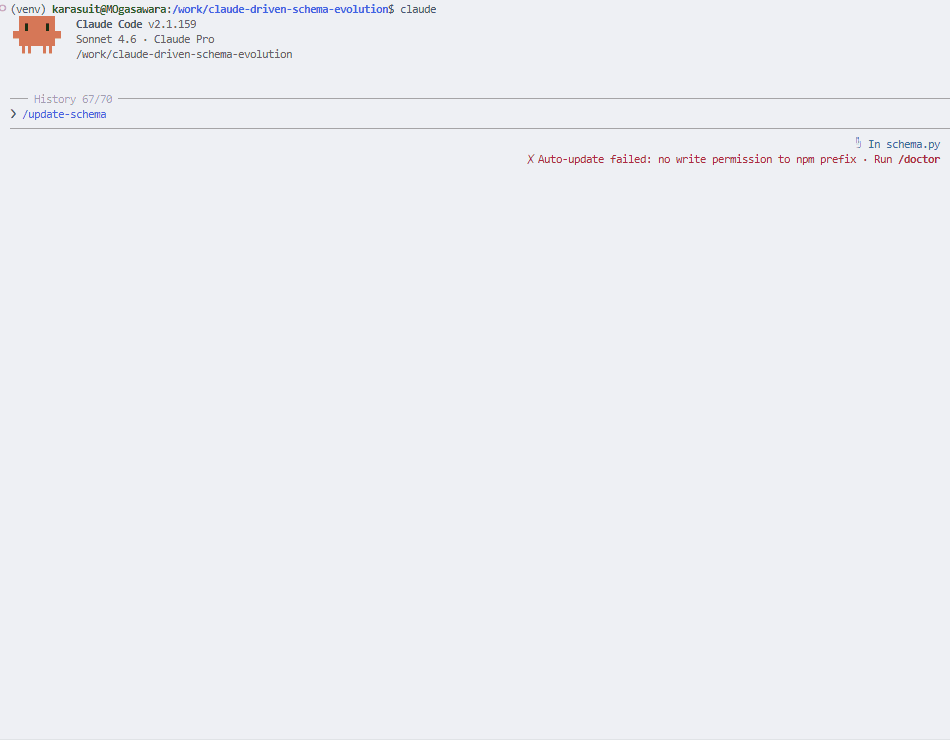
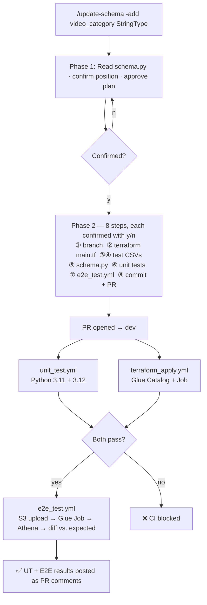
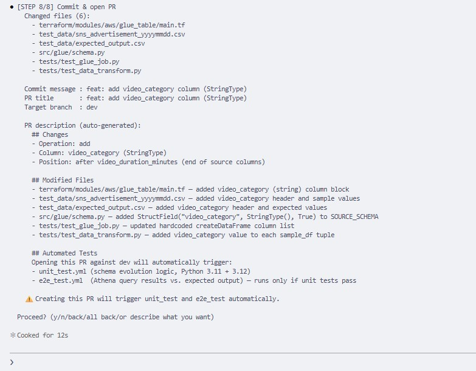
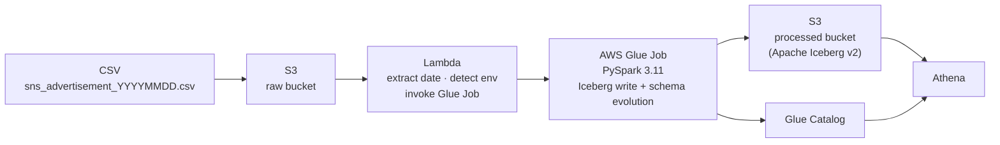
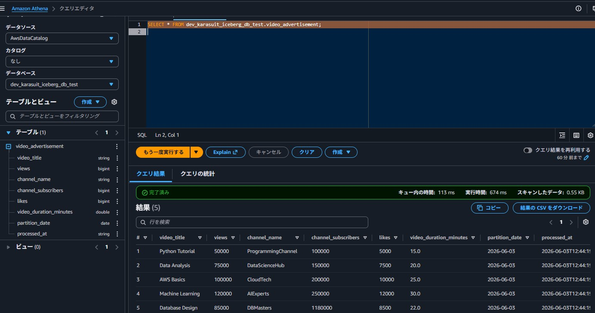
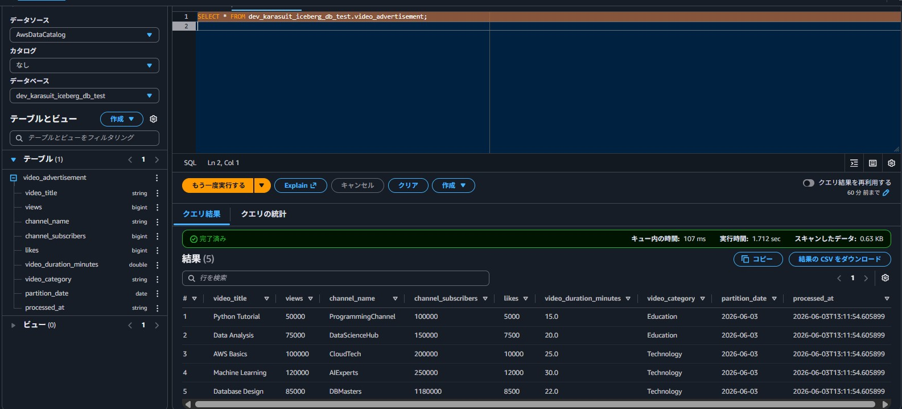

# Claude-Driven Schema Evolution

Schema changes in ETL pipelines are repetitive, error-prone, and expensive.
Every column addition touches multiple files — ETL logic, test data, expected outputs, infrastructure definitions — and missing even one breaks the pipeline silently.

This project solves that with **Claude as an interactive co-engineer**: a `/update-schema` command walks through each affected file step by step, shows exactly what will change, and asks for confirmation before touching anything. When done, it opens a PR that automatically triggers unit tests followed by E2E tests on AWS.



---

## Why This Exists

In a production data platform, schema changes are inevitable. The traditional approach requires a developer to:

1. Manually identify every file that references the schema
2. Apply consistent changes across ETL logic, tests, and infrastructure
3. Validate that nothing was missed

This is tedious, inconsistency-prone, and scales poorly as the pipeline grows. The cost isn't just time — it's the cognitive overhead of tracking dependencies and the risk of a silent failure in production.

**The goal**: reduce that process to a single command, with a human in the loop at every decision point.

---

## How It Works

### The `/update-schema` Command

Invoked inside a Claude Code session:

```
/update-schema -add video_category StringType
/update-schema -delete video_duration_minutes
/update-schema -add video_category StringType -delete video_duration_minutes
```

**Phase 1 — Planning** (no files touched): Claude reads `src/glue/schema.py`, shows the column list, and asks for the insert position. Once the full changeset is approved, Phase 2 begins.

**Phase 2 — Execute**: Each of the 8 files is shown as a diff with a `y/n` prompt. Nothing is written until confirmed.





### Auto-Generated PR

Claude creates the PR body automatically, summarizing every file touched:

```
## Changes
- Operation: add
- Column: video_category (StringType)
- Position: after video_duration_minutes (end of source columns)

## Modified Files
- `terraform/modules/aws/glue_table/main.tf` — added video_category (string) column block
- `test_data/sns_advertisement_yyyymmdd.csv` — added video_category header and sample values
- `test_data/expected_output.csv` — added video_category header and expected values
- `src/glue/schema.py` — added StructField("video_category", StringType(), True) to SOURCE_SCHEMA
- `tests/test_glue_job.py` — updated hardcoded createDataFrame column list
- `tests/test_data_transform.py` — added video_category value to each sample_df tuple
```

Once CI completes, UT and E2E results are automatically posted back as PR comments — see [PR #19](https://github.com/Karasu1t/claude-driven-schema-evolution/pull/19) for a real example.

---

## Pipeline Architecture



### Environment Separation

Lambda detects test vs. production by bucket name:

| | Test | Production |
|---|---|---|
| Input bucket | `dev-karasuit-test-raw-bucket` | `dev-karasuit-raw-bucket` |
| Output bucket | `dev-karasuit-test-processed-bucket` | `dev-karasuit-processed-bucket` |
| Glue database | `dev_karasuit_iceberg_db_test` | `dev_karasuit_iceberg_db` |

---

## Tech Stack

| Layer | Technology |
|---|---|
| ETL | AWS Glue 4.0 (PySpark 3.11) |
| Storage format | Apache Iceberg v2 |
| Catalog | AWS Glue Catalog |
| Orchestration | EventBridge → Lambda → Glue |
| Infrastructure | Terraform |
| CI/CD | GitHub Actions |
| AI workflow | Claude Code (`/update-schema` custom command) |

---

## Project Structure

```
.
├── src/glue/
│   ├── schema.py                      # SOURCE_SCHEMA / SOURCE_COLUMNS (single source of truth)
│   └── glue_job.py                    # PySpark ETL logic
├── terraform/
│   ├── modules/aws/
│   │   ├── glue_table/main.tf         # Glue Catalog table definition
│   │   ├── glue_job/                  # Glue Job configuration
│   │   ├── lambda_trigger/            # Lambda + IAM
│   │   ├── eventbridge/               # Scheduled trigger
│   │   └── s3_*/                      # Raw + processed buckets
│   └── env/dev/aws/main.tf
├── test_data/
│   ├── sns_advertisement_yyyymmdd.csv # E2E test input template
│   └── expected_output.csv            # E2E expected output
├── tests/
│   ├── test_glue_job.py               # Schema structure tests
│   └── test_data_transform.py         # Data value and type correctness tests
├── .github/workflows/
│   ├── ci.yml                         # PR pipeline: UT → E2E (sequential)
│   ├── unit_test.yml                  # Unit tests (also dispatchable)
│   ├── e2e_test.yml                   # E2E tests (also dispatchable)
│   ├── terraform_apply.yml
│   └── terraform_destroy.yml
└── .claude/commands/
    └── update-schema.md               # /update-schema command definition
```

---

## Schema

### Before / After Schema Evolution

| Before | After |
|--------|-------|
|  |  |

### Source columns (from CSV)

| Column | Type |
|---|---|
| `video_title` | STRING |
| `views` | LONG |
| `channel_name` | STRING |
| `channel_subscribers` | LONG |
| `likes` | LONG |
| `video_duration_minutes` | DOUBLE |
| `video_category` | STRING |

### Metadata columns (added by Glue Job)

| Column | Type | Description |
|---|---|---|
| `partition_date` | DATE | Extracted from filename (YYYYMMDD → YYYY-MM-DD) |
| `processed_at` | STRING | ISO timestamp of processing |

---


## Design Decisions

**Why confirmation at every step, not full automation?**
Schema changes are infrequent and high-stakes. A fully automated approach removes the human judgment that catches contextual errors — wrong data types, misaligned sample values, test cases that pass structurally but verify the wrong behavior. The interactive model keeps the engineer accountable while eliminating the mechanical work.

**Why Iceberg over Parquet?**
ACID transactions, time-travel queries, and schema versioning without rewriting entire partitions. For a pipeline where schema evolution is a first-class concern, Iceberg is the right primitive.

**Why UT before E2E in CI?**
E2E tests invoke real AWS infrastructure (Lambda, Glue, Athena, S3). Running them against broken logic wastes time and incurs unnecessary cost. Unit tests are fast and cheap; they act as a gate.

**Why run Terraform apply on PR, not just on merge to main?**
E2E tests query actual Athena against the live Glue Catalog. Without applying the schema change first, the catalog is stale and E2E will always fail on the PR. Applying on PR is the only way to make the full CI pipeline meaningful within a single PR. Note: this project uses a single AWS account for both dev and production workflows — in a team setup, dev and prod would be separate accounts and Terraform apply on PR would target only the dev account.
