# ETL Schema Evolution with Claude

**AI-Driven Automated ETL Adaptation for Schema Changes**

An end-to-end workflow that detects advertising platform schema changes, uses Claude AI to intelligently adapt dbt transformations, validates changes through automated tests, and surfaces results in pull requests—all with human review at the gate.

**Repository:** [`etl-schema-evolution-claude`](https://github.com/Karasu1t/etl-schema-evolution-claude)

---

## 日本語: プロジェクト概要

**背景:** 広告プラットフォームのデータスキーマは予測不可能に変更される。そのたびに、データエンジニアが手作業で dbt SQL を修正するのは煩雑で、修正者によって資材の品質にばらつきが出る。

**解決:** Claude AI を対話的に呼び出し、CSV の列定義をもとに dbt の schema.yml と SQL を自動修正。修正後、GitHub Actions で dbt テストを実行し、結果を PR コメントとして記録。手作業削減と品質均一化を同時に実現。

---

## What This Does

1. **Detect & Input**: Platform schema change notification (e.g., "Column X added")
2. **Acquire Spec**: Download CSV with updated column definitions
3. **Interactive Fix**: Claude API dialogue to generate dbt schema.yml & SQL updates
4. **Commit & PR**: Push changes, create PR
5. **Validate & Report**: GitHub Actions runs `dbt compile` + `dbt test`, surfaces results in PR comment

**Key Outcome:** Schema change → dbt adapted → UT passed → proof in PR, all within one workflow.

---

## Technical Stack

| Component               | Purpose                        | Why                                                                 |
| ----------------------- | ------------------------------ | ------------------------------------------------------------------- |
| **dbt**                 | SQL & schema management        | De facto standard for data transformation; schema-as-code           |
| **Claude API**          | Interactive transformation fix | Understands data lineage & context; handles nuanced column mappings |
| **GitHub Actions**      | CI/CD pipeline                 | Proof & auditability; integrates with PR workflow                   |
| **Python**              | CLI tool (`ut-etl` command)    | Orchestrates CSV download, Claude dialogue, dbt invocation          |
| **Snowflake + Iceberg** | Data platform                  | Enterprise choice; portable table format                            |

---

## Why These Choices

| Concern              | Solution                                                             | Trade-off                                   |
| -------------------- | -------------------------------------------------------------------- | ------------------------------------------- |
| **Quality variance** | AI-assisted + automated tests → rules enforcement, not manual tweaks | Requires trust in test coverage             |
| **Reproducibility**  | Code-as-spec (CSV) + dbt + Git history                               | Initial setup more involved than ad-hoc SQL |
| **Governance**       | PR + CI gates before merge; Claude output is draft, not final        | Not fully autonomous; human review required |
| **Portability**      | Iceberg + open SQL, not Snowflake-specific                           | Adds one more concept (Iceberg) to learn    |

---

## Workflow Diagram

```mermaid
graph LR
    Notify["📢 Platform Change<br/>Notified"] -->|"Column X updated"| Acquire["📥 Download CSV<br/>Column Spec"]
    Acquire --> Dialog["💬 Claude Dialogue<br/>Interactive Fix"]
    Dialog -->|"schema.yml<br/>& SQL"| Commit["📝 Commit & Push"]
    Commit --> PR["🔀 Create PR"]
    PR -->|"Trigger"| GHA["⚙️ GitHub Actions"]
    GHA -->|"1. dbt parse"| Parse["Parse SQL"]
    Parse -->|"2. dbt compile"| Compile["Generate SQL"]
    Compile -->|"3. dbt test"| Test["Run Schema Tests"]
    Test -->|"✅/❌"| Comment["💬 PR Comment<br/>with Results"]
    Comment --> Gate{Merge?}
    Gate -->|"✅ All Green"| Merge["✓ Ready"]
    Gate -->|"❌ Failed"| FixNeeded["Fix & Re-push"]
```



---

## Scope

### In Scope ✅

- **Spec Handling**: CSV download and parsing
- **Claude Integration**: Interactive dbt schema / SQL generation
- **dbt Workflow**: schema.yml, model SQL, basic test definitions
- **GitHub Actions**: PR-triggered validation (parse → compile → test)
- **PR Reporting**: Surfaces test results, dbt parse/compile errors
- **Local Dev**: Reproducible setup with sample CSV & mock schema

### Out of Scope ❌

- Automatic schema change detection (assumed notified)
- Google Drive API integration (CSV download is manual or via URL)
- Advanced tests (`dbt-expectations`, anomaly detection, etc.)
- Snowflake / Azure IaC or provisioning
- Full data lineage tracing or impact analysis
- Production deployment automation

**Assumption:** This is a **personal portfolio** demonstrating **AI-assisted data tooling and governance**. Production concerns (cost optimization, SLA monitoring, multi-region failover) are explicitly out of scope.

---

## Technology Rationale

### dbt

- **Why**: Schema-as-code; test definitions live in the same repo as SQL; industry standard for data transformation
- **Expertise**: First hands-on project with dbt; learning data engineering best practices

### Claude API

- **Why**: Context-aware; can map old columns → new columns; understands SQL and schema intent
- **Not**: Fully autonomous; Claude is a draft generator; all outputs are reviewed before merge

### GitHub Actions

- **Why**: Native Git integration; proof-of-execution visible in PR; no external CI/CD service needed
- **Outcome**: Each schema change has an audit trail (commit, PR, Checks, test logs)

### Snowflake + Iceberg

- **Why**: Enterprise-standard data stack; Iceberg is portable (not vendor-locked); widely adopted across industries
- **Demo**: CSV-based mock data for reproducibility; real Snowflake connection optional

---

## Roadmap

### Phase 1: Foundation (Planned)

- [ ] dbt project setup (raw → stg layers, sample schema)
- [ ] Python CLI tool (`ut-etl` command)
- [ ] Claude API integration (dialogue-driven schema/SQL fix)
- [ ] GitHub Actions workflow (PR-triggered validation)
- [ ] Sample CSV spec file
- [ ] End-to-end demo + screenshots

### Phase 2: Enhancement (Future)

- [ ] Google Drive API integration (auto-download CSV)
- [ ] Advanced test generation (`dbt-expectations`)
- [ ] dbt DAG impact analysis (downstream model warnings in PR)
- [ ] Snowflake schema diff checker
- [ ] Terraform for demo environment setup

### Phase 3: Production Readiness (Future)

- [ ] RBAC & secrets management
- [ ] Multi-environment support (dev/staging/prod)
- [ ] Cost monitoring & optimization
- [ ] Full observability & alerting

---

## Key Files (Future)

```
.
├── README.md                    (this file)
├── LICENSE                      (MIT)
├── .gitignore
├── .github/
│   └── workflows/
│       ├── pr-validate.yml      (dbt parse/compile/test on PR)
│       └── daily-sync.yml       (optional: nightly data sync)
├── dbt/
│   ├── dbt_project.yml
│   ├── profiles.yml.example
│   ├── models/
│   │   ├── raw/                 (source tables)
│   │   ├── stg/                 (staging + schema tests)
│   │   └── mart/                (analytics—optional)
│   ├── tests/
│   │   ├── generic/
│   │   └── specific/
│   └── macros/
├── src/
│   ├── ut_etl/
│   │   ├── cli.py               (entry point: ut-etl command)
│   │   ├── claude_agent.py      (Claude API caller)
│   │   ├── csv_loader.py        (CSV parsing)
│   │   └── dbt_renderer.py      (schema.yml & SQL generation)
│   └── tests/
├── specs/
│   ├── sample_columns.csv       (mock: old schema)
│   └── sample_columns_updated.csv (mock: new schema)
└── docs/
    ├── 01_setup.md
    ├── 02_workflow.md
    └── 03_claude_prompts.md
```

---

## Getting Started (Placeholder)

```bash
# Clone repo
git clone https://github.com/Karasu1t/etl-schema-evolution-claude.git
cd etl-schema-evolution-claude

# Create Python venv
python3 -m venv venv
source venv/bin/activate

# Install dependencies (future)
pip install -r requirements.txt

# Set Claude API key
export CLAUDE_API_KEY="your-key-here"

# Run demo (future)
python src/ut_etl/cli.py --csv specs/sample_columns_updated.csv --dbt-project dbt/
```

See [docs/01_setup.md](docs/01_setup.md) for detailed instructions.

---

## Design Philosophy

1. **AI as Draft, Not Final**: Claude generates candidates; dbt tests and PR reviews filter.
2. **Auditability First**: Every change is a commit, PR, and CI log; no silent database mutations.
3. **Portability**: Open table format (Iceberg), not vendor SQL dialects; reproducible in any region.
4. **Hands-On Learning**: Deliberately explores new domains (Iceberg, dbt, Azure, Claude API integration) while maintaining production-grade design principles from 11 years of platform engineering experience.

---

## About

**Portfolio Purpose**: Demonstrates hands-on expertise in:

- AI-assisted data workflows
- Data pipeline governance & CI/CD
- Modern data stack (dbt, Snowflake, Iceberg)
- Enterprise-grade architecture

**Location & Mobility**: Open to relocation, hybrid, or remote arrangements.

---

## License

MIT License. See [LICENSE](LICENSE) for details.

---

## Questions or Feedback?

This repository is a **living portfolio**. If you spot ideas for improvement, feel free to discuss or fork.

**Built with:** Claude + dbt + GitHub Actions
**Last Updated:** May 2026
